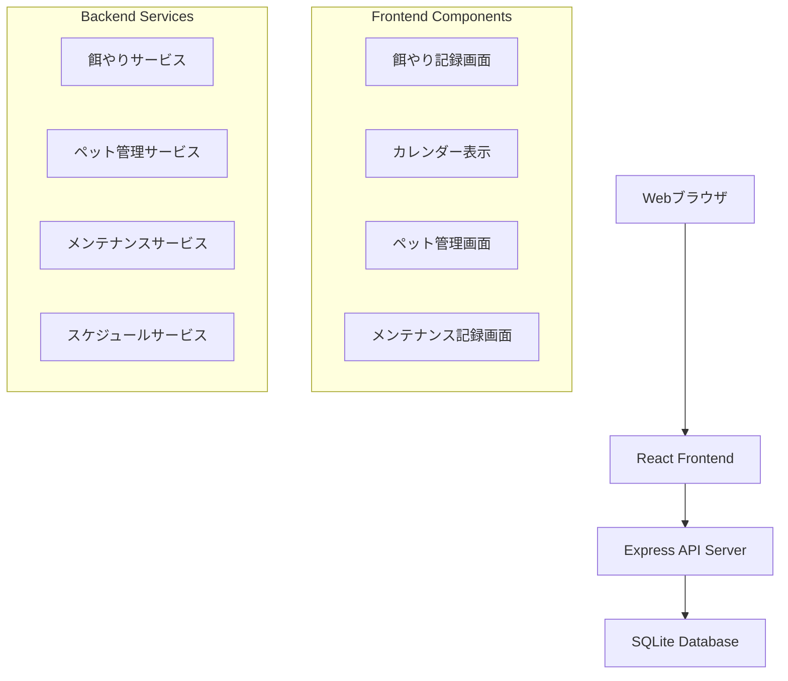

# 設計文書

## 概要

ペット管理システムは、餌やり記録、体重管理、メンテナンス履歴を統合管理する Web アプリケーションです。React/TypeScript フロントエンドと Node.js/Express バックエンドで構成し、SQLite データベースを使用してデータを永続化します。

## アーキテクチャ

### システム構成



### 技術スタック

- **フロントエンド**: React 18, TypeScript, CSS Modules
- **バックエンド**: Node.js, Express.js, TypeScript
- **データベース**: SQLite3
- **日付処理**: date-fns
- **HTTP クライアント**: Axios

## コンポーネントとインターフェース

### フロントエンドコンポーネント

#### 1. FeedingRecordForm

- 餌やり記録の入力フォーム
- 餌の種類選択（ドロップダウン）
- 時刻設定（デフォルト：最も近いスケジュール時刻）
- 前回の摂食状況記録（未記録の場合のみ表示）
  - 「食べきった」ボタンと「残した」ボタンで直接記録
  - ボタンクリックで即座に摂食状況を更新

#### 2. CalendarView

- 月間カレンダー表示
- その日のすべての餌やり記録を時刻付きで表示
- 餌やり記録の視覚化（緑：完食、黄：残食、グレー：未記録）
- 体重記録とメンテナンス記録の表示
- 日付クリックで詳細モーダル表示
- 詳細モーダルでの記録編集・削除機能
- 摂食状況のワンクリック切り替え機能

#### 3. PetManagement

- ペット個体の登録・編集
- 体重記録の入力・履歴表示

#### 4. MaintenanceRecord

- 給水器フィルター交換記録
- トイレ砂交換記録
- 爪切り記録

### バックエンド API

#### 餌やり関連 API

```typescript
GET /api/feeds - 餌の種類一覧取得
POST /api/feeds - 餌の種類登録
GET /api/feeding-records - 餌やり記録取得
GET /api/feeding-records/date-range?start=YYYY-MM-DD&end=YYYY-MM-DD - 期間指定での餌やり記録取得
POST /api/feeding-records - 餌やり記録作成
PUT /api/feeding-records/:id - 餌やり記録更新（餌の種類、時刻）
PUT /api/feeding-records/:id/consumption - 摂食状況更新
DELETE /api/feeding-records/:id - 餌やり記録削除
GET /api/feeding-schedules - 餌やりスケジュール取得
POST /api/feeding-schedules - 餌やりスケジュール登録
```

#### ペット管理 API

```typescript
GET /api/pets - ペット一覧取得
POST /api/pets - ペット登録
GET /api/pets/:id/weights - 体重記録取得
POST /api/pets/:id/weights - 体重記録作成
```

#### メンテナンス API

```typescript
GET /api/maintenance - メンテナンス記録取得
POST /api/maintenance/water-filter - 給水器フィルター交換記録
POST /api/maintenance/litter-box - トイレ砂交換記録
POST /api/maintenance/nail-clipping - 爪切り記録
```

## データモデル

### データベーススキーマ

```sql
-- 餌の種類
CREATE TABLE feed_types (
    id INTEGER PRIMARY KEY AUTOINCREMENT,
    manufacturer VARCHAR(100) NOT NULL,
    product_name VARCHAR(100) NOT NULL,
    created_at DATETIME DEFAULT CURRENT_TIMESTAMP
);

-- ペット個体
CREATE TABLE pets (
    id INTEGER PRIMARY KEY AUTOINCREMENT,
    name VARCHAR(50) NOT NULL,
    created_at DATETIME DEFAULT CURRENT_TIMESTAMP
);

-- 餌やりスケジュール
CREATE TABLE feeding_schedules (
    id INTEGER PRIMARY KEY AUTOINCREMENT,
    time TIME NOT NULL,
    is_active BOOLEAN DEFAULT TRUE,
    created_at DATETIME DEFAULT CURRENT_TIMESTAMP
);

-- 餌やり記録
CREATE TABLE feeding_records (
    id INTEGER PRIMARY KEY AUTOINCREMENT,
    feed_type_id INTEGER NOT NULL,
    feeding_time DATETIME NOT NULL,
    consumed BOOLEAN NULL, -- NULL: 未記録, TRUE: 完食, FALSE: 残食
    created_at DATETIME DEFAULT CURRENT_TIMESTAMP,
    FOREIGN KEY (feed_type_id) REFERENCES feed_types(id)
);

-- 体重記録
CREATE TABLE weight_records (
    id INTEGER PRIMARY KEY AUTOINCREMENT,
    pet_id INTEGER NOT NULL,
    weight DECIMAL(5,2) NOT NULL,
    measured_date DATE NOT NULL,
    created_at DATETIME DEFAULT CURRENT_TIMESTAMP,
    FOREIGN KEY (pet_id) REFERENCES pets(id)
);

-- メンテナンス記録
CREATE TABLE maintenance_records (
    id INTEGER PRIMARY KEY AUTOINCREMENT,
    type ENUM('water_filter', 'litter_box', 'nail_clipping') NOT NULL,
    performed_at DATETIME NOT NULL,
    notes TEXT,
    created_at DATETIME DEFAULT CURRENT_TIMESTAMP
);
```

### TypeScript 型定義

```typescript
interface FeedType {
  id: number;
  manufacturer: string;
  productName: string;
  createdAt: Date;
}

interface Pet {
  id: number;
  name: string;
  createdAt: Date;
}

interface FeedingSchedule {
  id: number;
  time: string; // HH:mm format
  isActive: boolean;
  createdAt: Date;
}

interface FeedingRecord {
  id: number;
  feedTypeId: number;
  feedingTime: Date;
  consumed: boolean | null;
  createdAt: Date;
  feedType?: FeedType;
}

interface WeightRecord {
  id: number;
  petId: number;
  weight: number;
  measuredDate: Date;
  createdAt: Date;
  pet?: Pet;
}

interface MaintenanceRecord {
  id: number;
  type: 'water_filter' | 'litter_box' | 'nail_clipping';
  performedAt: Date;
  notes?: string;
  createdAt: Date;
}
```

## カレンダー機能の詳細設計

### カレンダー表示ロジック

#### 複数記録の表示

- 1 日に複数の餌やり記録がある場合、すべてを時刻順で表示
- 各記録は時刻（HH:mm）形式で表示
- 記録の色分け：完食（緑）、残食（黄）、未記録（グレー）

#### 詳細モーダルの構成

```typescript
interface DayDetailModal {
  selectedDate: Date;
  feedingRecords: FeedingRecord[];
  weightRecords: WeightRecord[];
  maintenanceRecords: MaintenanceRecord[];
  editingRecord: FeedingRecord | null;
  showModal: boolean;
}
```

#### インライン編集機能

- 編集モードでは餌の種類選択ドロップダウンと時刻入力フィールドを表示
- 保存・キャンセルボタンで編集状態を制御
- 編集中は他の記録の編集を無効化

#### 摂食状況の切り替え

- 摂食状況表示部分をクリック可能にする
- 未記録 → 完食 → 残食 → 未記録の順で循環
- 即座に API を呼び出して更新

### 状態管理

```typescript
interface CalendarState {
  currentDate: Date;
  feedingRecords: FeedingRecord[];
  weightRecords: WeightRecord[];
  maintenanceRecords: MaintenanceRecord[];
  feedTypes: FeedType[];
  selectedDate: Date | null;
  showDetailModal: boolean;
  editingRecord: FeedingRecord | null;
  loading: boolean;
  message: { type: 'success' | 'error'; text: string } | null;
}
```

### API インテグレーション

#### データ取得の最適化

- カレンダー表示時は月単位でのデータ取得
- 詳細モーダル表示時は追加のデータ取得は不要
- 編集・削除後は該当記録のみ状態を更新

#### エラーハンドリング

- 編集・削除操作の失敗時は適切なエラーメッセージを表示
- ネットワークエラー時は再試行オプションを提供
- 楽観的更新で UX を向上

## エラーハンドリング

### フロントエンド

- API エラーの統一的な処理
- ユーザーフレンドリーなエラーメッセージ表示
- ネットワークエラー時の再試行機能
- フォームバリデーションエラーの表示

### バックエンド

- HTTP ステータスコードの適切な使用
- 構造化されたエラーレスポンス
- データベースエラーのハンドリング
- バリデーションエラーの詳細情報提供

```typescript
interface ApiError {
  message: string;
  code: string;
  details?: any;
}
```

## テスト戦略

### フロントエンドテスト

- コンポーネント単体テスト（React Testing Library）
- フォームバリデーションテスト
- カレンダー表示ロジックテスト
- API 統合テスト

### バックエンドテスト

- API エンドポイント単体テスト（Jest + Supertest）
- データベース操作テスト
- ビジネスロジックテスト
- エラーハンドリングテスト

### E2E テスト

- 餌やり記録の完全なフロー
- カレンダー表示の動作確認
- ペット管理機能の統合テスト

## セキュリティ考慮事項

- SQL インジェクション対策（パラメータ化クエリ）
- XSS 対策（入力値のサニタイゼーション）
- CSRF 対策（適切な HTTP メソッド使用）
- 入力値バリデーション（フロントエンド・バックエンド両方）

## パフォーマンス考慮事項

- データベースインデックスの適切な設定
- カレンダー表示時の効率的なデータ取得
- フロントエンドでの適切な状態管理
- 画像やアセットの最適化
